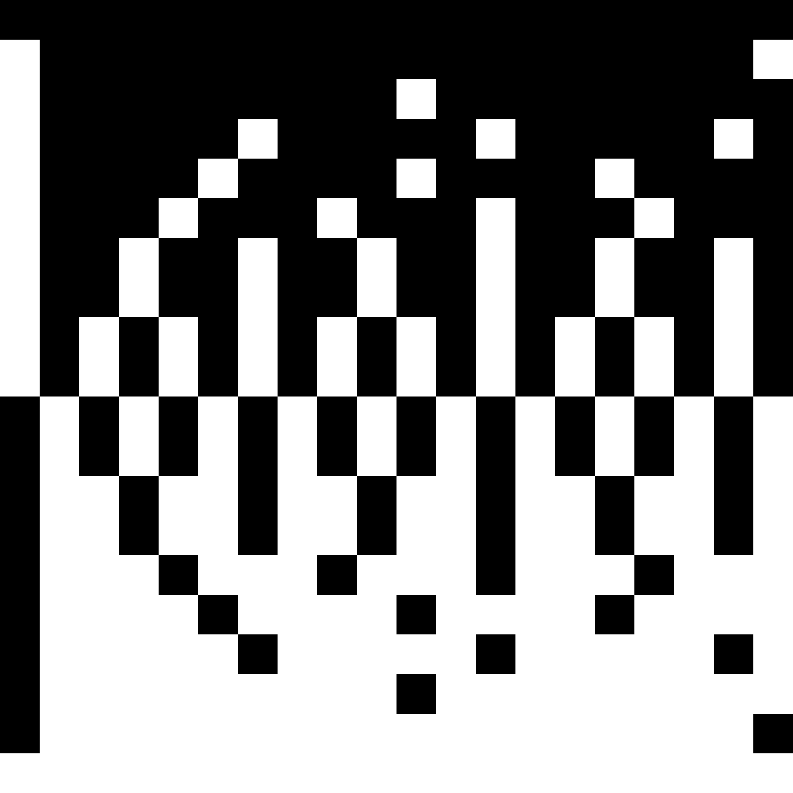

<p align="center" width="100%">
     
</p>
BEHEMA (BEHavioral EMergent Automaton) is a spiking neural network library inspired by cellular automata.

Behema borrows concepts such as grid layout and kernels from cellular automata to boost efficiency in highly parallel environments.
The implementation aims at mimicking a biological brain as closely as possible without losing performance.

The learning pattern of a Behema neural network is continuos, with no distinction between training, validation and deploy. The network is continuously changed by its inputs and therefore can produce unexpected (emerging) results.

## Shared library installation (Linux)
All the following commands install behema as a dynamic library by default, but you can tell the make command to install it as a static library by setting the dedicated variable `MODE=archive`:

`make install MODE=archive`

You can also specify the C compiler by setting the dedicated variable `CCOMP` as in `CCOMP=gcc-14`:

`make install CCOMP=gcc-14`

### Standard
Run `make install` or `make std-install` to install the default (CPU) package in a system-wide dynamic or static library.

### CUDA
Run `make cuda-install` to install the CUDA parallel (GPU) package in a system-wide dynamic or static library.

Optionally you can specify the compute capability of your GPU with the dedicated variable `CUDA_ARCH`. This allows for some extra optimizations:
`make cuda-install CUDA_ARCH=sm_61`

Warnings:
* The CUDA version only works with NVIDIA GPUS
* The CUDA version requires the CUDA SDK and APIs to work
* The CUDA SDK or APIs are not included in any install_deps.sh script

### OpenCL
TODO

### Uninstall
Run `make uninstall` to uninstall any previous installation.

WARNING: Every time you `make` a new package the previous installation is overwritten.

## How to use
### Header files
Once the installation is complete you can include the library by `#include <behema/behema.h>` and directly use every function in the packages you compiled.

### Linking
During linking you can specify `-lbehema` in order to link the compiled functions.

### Usage example
The first step is to create and initialize two cortices by:
```
// Define starting parameters.
cortex_size_t cortex_width = 100;
cortex_size_t cortex_height = 60;
nh_radius_t nh_radius = 2;

// Define the sampling interval, used later.
ticks_count_t sampleWindow = 10;

// Create the cortices.
cortex2d_t even_cortex;
cortex2d_t odd_cortex;

// Initialize the two cortices.
c2d_create(&even_cortex, cortex_width, cortex_height, nh_radius);
c2d_create(&odd_cortex, cortex_width, cortex_height, nh_radius);
```
This will setup two identical 100x60 cortices with default values.

Optionally, before copying the first cortex to the second, its properties can be set by:
```
c2d_set_evol_step(&even_cortex, 0x20U);
c2d_set_pulse_window(&even_cortex, 0x3A);
c2d_set_syngen_beat(&even_cortex, 0.1F);
c2d_set_max_touch(&even_cortex, 0.2F);
c2d_set_sample_window(&even_cortex, sampleWindow);
```
Now the updated cortex needs to be copied to the second by:
```
odd_cortex = *c2d_copy(&even_cortex);
```
The two cortices will be updated alternatively at each iteration step.

Now the cortex can already be deployed, but it's often useful to setup its inputs and outputs:
```
// Support variable for input sampling.
ticks_count_t samplingBound = sampleWindow - 1;

// Define an input rectangle (the area of neurons directly attached to domain inputs).
// Since even_cortex and odd_cortex are 2D cortices, inputs are arranged in a 2D surface.
// inputCoords contains the bound coordinates of the input rectangle as [x0, y0, x1, y1].
cortex_size_t inputsCoords[] = {10, 5, 40, 20};

// Allocate inputs according to the defined area.
ticks_count_t* inputs = (ticks_count_t*) malloc((inputsCoords[2] - inputsCoords[0]) * (inputsCoords[3] - inputsCoords[1]) * sizeof(ticks_count_t));

// Support variable used to keep track of the current step in the sampling window.
ticks_count_t sample_step = samplingBound;
```

### Input mapping
Input mapping defines how input values are mapped to spike trains.

Every cortex has a field for defining a `pulse_window`, which is the amount of timesteps over which inputs are mapped into spike trains.
Input mapping defines how a numerical input maps to a spike train over the `pulse_window`.
Therefore spike trains repeat every `pulse_window` timesteps and you can see the shape spike trains acquire using different input mapping algorithms.

In the following plots, you can see numerical inputs on the y-coordinate (premapped to a [0.0,1.0] domain) and time on the x-coordinate.
White means there's a spike, while black means no spike.

Inputs are always normalized to a [0.0,1.0] range for input mapping to work intuitively.

<table>
    <tr>
        <td></td>
        <td>pulse_window</td>
    </tr>
    <tr>
        <td></td>
        <td>10</td>
        <td>20</td>
        <td>100</td>
        <td>1000</td>
    </tr>
    <tr>
        <td>linear</td>
        <td></td>
        <td></td>
        <td></td>
        <td></td>
    </tr>
    <tr>
        <td>floored proportional</td>
        <td></td>
        <td></td>
        <td></td>
        <td></td>
    </tr>
    <tr>
        <td>rounded proportional</td>
        <td></td>
        <td></td>
        <td></td>
        <td></td>
    </tr>
</table>

## TODO
Neurons competition for synapses

### Examples
The [examples](/samples/README.md) directory contains some useful use cases